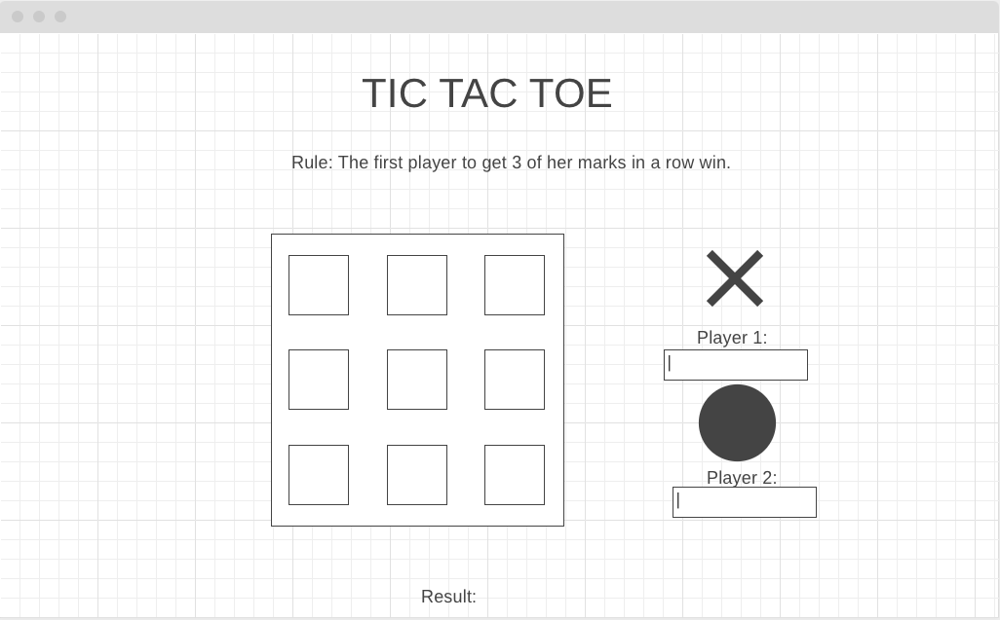

# Project 0: TIC TAC TOE

> Completed simple game for 2 players.
---

## **Game rule**
First player to get 3 of their token in a row win.

## **How to start?**
1. Visit the game page [Tic Tac Toe](https://btee9910.github.io/tictacttoe/).
1. Choose Single player(*not avaialble yet*) or 2 players.
1. Insert players' name and click <mark>Next</mark> or use default names, 'Player 1' & 'Player 2', by clicking the <mark>Skip</mark> button.
1. Choose which player goes first by clicking on the token.

## **During the game**
* Brown color border line around the player's token box indicate the turn of the player.
* Draft token will be shown on the game board while mouse cursor is hovering on each box.
* Simple move over to an empty box and click on it if you would like to place your token on that box.
* First player to get 3 of their token in a row win, otherwsie it will be a draw game.
* When a player win, a trophy will be placed on the top right corner of the winning token.

Refresh broswer to start a new game.

---
## Stack includes:
* HTML
* CSS
* JavaScript
* JQuery

### Below is the first draft design layout for this project.
---

